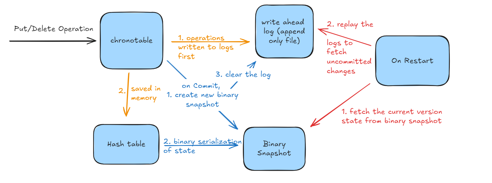

# chronotable
in-memory hash table implementation with AOF persistence and versioning via point-in-time snapshotting supporting rollbacks and querying past states.

### Features
- In-memory storage using a Go map
- Thread safe operations via mutex locking.
- write ahead logging of put/delete operations to Append Only File(AOF).
- Binary serialization/deserialization of current snapshot state.
- Versioning to support rollbacks and querying past states.
- Replay writes in case of crash
- Start from latest state in case of restart
- Viper based configuration management 

### Workflow 
